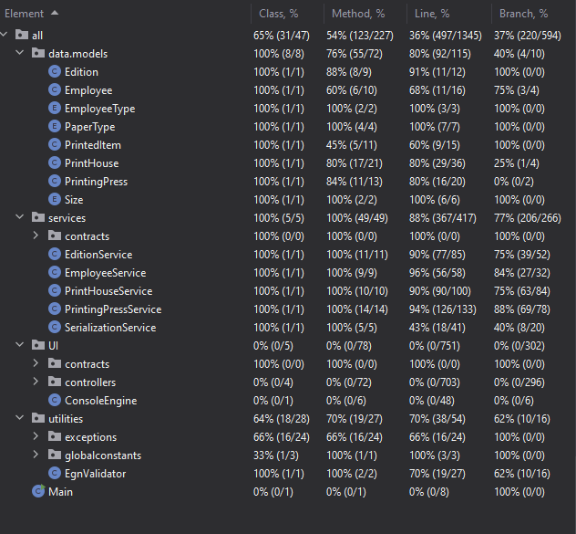

# **Print House Management System**

## Overview

This project is the **final project** for the university course:  
**[CITB408 Java Programming - Spring Semester 2020/2021](https://ecatalog.nbu.bg/default.asp?V_Year=2021&YSem=4&Spec_ID=&Mod_ID=&PageShow=coursepresent&P_Menu=courses_part1&Fac_ID=3&M_PHD=&P_ID=832&TabIndex=1&K_ID=48852&K_TypeID=10&l=0)**.

## Project Introduction

The **Print House Management System** is a Java-based console application designed to manage printing operations within multiple print houses. It supports CRUD operations for print houses, employees, printing presses, and editions, along with calculating printing costs, revenues, and managing paper loads. The system adheres to a specification requiring robust exception handling, serialization for data persistence, and comprehensive unit testing.

---

## Table of Contents

- [Features](#features)
- [Architecture](#architecture)
- [UML Class Diagram](#uml-class-diagram)
- [Technologies used](#technologies-used)
- [Installation](#installation)
- [Usage](#usage)
- [Dependencies](#dependencies)
- [Tests](#tests)
- [Logging](#logging)
- [Contributing](#contributing)
- [License](#license)
- [Acknowledgments](#acknowledgments)
- [Repository](#repository)

---

## Features

- **Print Houses**: Manage multiple print houses with configurable salary increments (e.g., 15% for managers), paper costs, base salaries, and discount policies.
- **Employees**: Add Operators and Managers identified by ЕГН, with salaries derived from `PrintHouse` and conditional bonuses based on revenue targets.
- **Printing Presses**: Configure presses with paper capacity, color capability, and print speed; load paper and print editions.
- **Editions**: Manage books (e.g., "Lord of the Rings") with titles, page counts, and sizes (A1–A5).
- **Cost and Revenue**: Calculate print costs (size-based paper pricing) and revenues (volume discounts after 10 copies).
- **Persistence**: Save/load data using serialization.
- **Exception Handling**: Custom exceptions (e.g., `InvalidEmployeeException`, `InvalidPrintHouseException`).
- **Unit Tests**: Comprehensive tests with JUnit 5 and Mockito for service-layer validation.

---

## Architecture

The project is organized into several packages:

- **`data.models`**: Core entities (`PrintHouse`, `Employee`, `PrintingPress`, `Edition`, `PrintedItem`) and enums (`PaperType`, `Size`, `EmployeeType`).
- **`services`**: Business logic implementations (`PrintHouseService`, `EmployeeService`, `PrintingPressService`, `EditionService`, `SerializationService`).
- **`services.contracts`**: Service interfaces (`IPrintHouseService`, `IEmployeeService`, `IPrintingPressService`, `IEditionService`) defining APIs.
- **`UI.controllers`**: Console UI classes (`PrintHouseController`, `EmployeeController`, `PrintingPressController`, `EditionController`).
- **`utilities`**: Utility classes (e.g., `ExceptionMessages`).
- **`utilities.exceptions`**: Custom exceptions (e.g., `InvalidEmployeeException`).
- **`services` (test directory)**: JUnit 5 tests (e.g., `EmployeeServiceTests`) with Mockito.

---

## UML Class Diagram

Below is a simplified UML class diagram illustrating the key entities and their relationships in the Print House
Management System:


[UML Class diagram PlantUML link](UML_CLASS_DIAGRAM.puml)

---

## Technologies used

- **Java**: Core language (JDK 21 recommended, can be downgraded to JDK 17+ for some methods like `.getFirst()` instead of `.get(0)`).
- **SLF4J**: Logging framework for debugging and error tracking.
- **JUnit 5**: Unit testing framework.
- **Mockito**: Mocking framework for tests.
- **Gradle**: Build tool for dependency management and compilation.
- **PlantUML**: Tool for generating UML diagrams from text-based descriptions.
- **Serialization**: Built-in Java serialization for persistence.

---

## Installation

Follow these steps to set up the Print House Management System locally:

### Prerequisites

- Java Development Kit (JDK) 21 or higher.
- Gradle (for building the project).

### Installation

1. **Clone the Repository**:

   ```bash
   git clone <repository-url>
   cd print-house-management-system
   ```

2. **Build the Project**
   Using the Gradle wrapper:

    ```bash
    ./gradlew clean build
    ```

   Or with an installed Gradle:

    ```bash
    gradle clean build
    ```

   This compiles the code and runs tests.

3. **Run the Application**

    ```bash
    ./gradlew run
    ```

   Or, if built manually:

    ```bash
    java -cp build/libs/print-house-management-system.jar UI.Main
    ```

---

## Usage

The application features a console-based interface. Upon launch, a main menu provides options to manage print houses, employees, printing presses, editions.

### Running the Application

Start the application from the main menu:

   ```text
    === Print House Management System ===
    1. Manage Print Houses
    2. Manage Employees
    3. Manage Printing Presses
    4. Manage Editions
    0. Exit
    Enter your choice: 
   ```

### Example Workflow

1. **Create a Print House:**

    ```text
    Enter your choice: 1
    --- Print House Management ---
    Enter your choice: 1
    Salary increment %: 15
    Paper increment %: 20
    Base salary: 2000
    Increment eligible roles (comma-separated, e.g., OPERATOR,MANAGER): MANAGER
    Revenue target: 10000
    Discount count: 10
    Discount %: 10
    Print house created successfully at index 0
    ```

2. **Add a Printing Press:**

    ```text
    Enter your choice: 3
    --- Printing Press Management ---
    Enter your choice: 1
    Select print house number: 1
    Max paper load: 5000
    Current paper load: 4000
    Color capable (true/false): true
    Max pages per minute: 300
    Printing press added successfully.
    ```

3. **Add an Edition:**

    ```text
    Enter your choice: 4
    --- Edition Management ---
    Enter your choice: 2
    Select print house number: 1
    Title: Lord of the Rings
    Number of pages: 1300
    Size (A5/A4/A3/A2/A1): A4
    Edition added successfully.
    ```

4. **Print an Item:**

    ```text
    Enter your choice: 3
    Enter your choice: 5
    Select print house number: 1
    Select printing press number: 1
    Select edition number: 1
    Paper type (STANDARD/GLOSSY/NEWSPAPER): STANDARD
    Price per copy: 60
    Number of copies: 5
    Color print (true/false): true
    Item printed successfully.
    ```

5. **Calculate Revenue:**

    ```text
    Enter your choice: 7
    Select print house number: 1
    Total Revenue: 300.00
    ```

6. **Save Data:**

    ```text
    Enter your choice: 1
    Enter your choice: 3
    Enter file path: print_houses.ser
    Print houses saved successfully.
    ```

### Expanded Usage workflow

For more detailed usage see the [USAGE.md](https://github.com/StefanYankov/PrintHouseManagementSystem/blob/master/USAGE)

---

## Dependencies

- **SLF4J**: For logging.
- **Logback**: As the logging implementation.

---


## Tests

### Unit testing

The project includes extensive unit tests using JUnit 5 and Mockito, covering the service layer, and serialization functionality. To run the tests:

   ```bash
   ./gradlew test
   ```

### Unit tests Code coverage



---

## Logging

Logging is implemented using SLF4J with Logback. Logs are output to the console by default and can be customized via the ``logback.xml`` file located in ``src/main/resources``.

---

## Contributing

As this is a university course project contribuiting is generally not required.

---

## License

The project is licensed under MIT License. See the **[LICENSE](https://github.com/StefanYankov/PrintHouseManagementSystem/blob/master/LICENSE)** file for details.

---

## Acknowledgments

- This project was developed as part of the **CITB408 Java Programming** course at [New Bulgarian University](https://nbu.bg/).
- Special thanks to the course instructor for creating the project requirements.

---

## Repository

GitHub Repository: [https://github.com/StefanYankov/PrintHouseManagementSystem/](https://github.com/StefanYankov/PrintHouseManagementSystem/)

---
